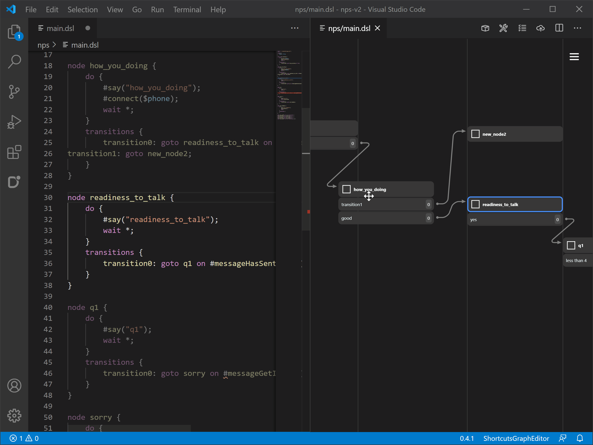
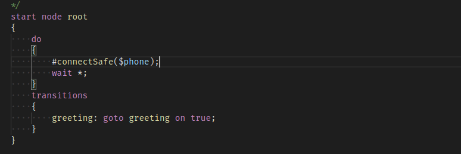
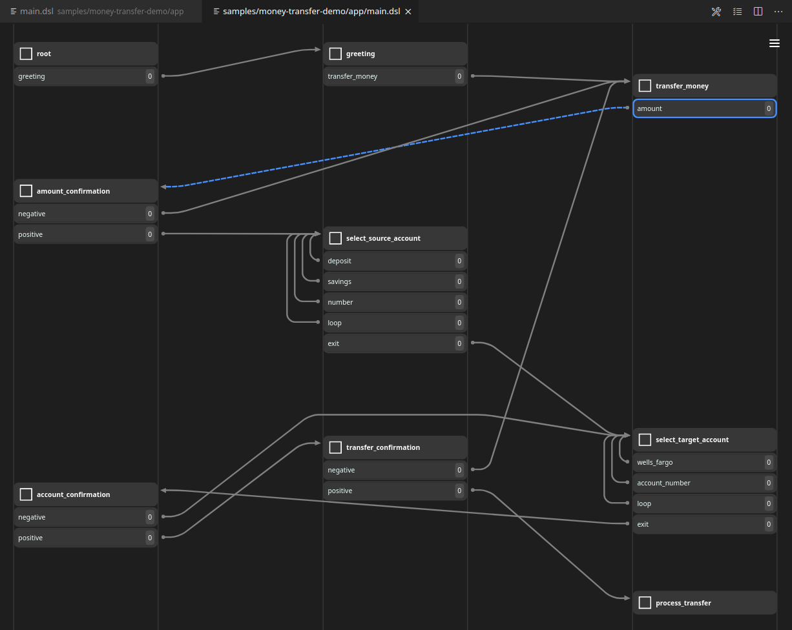

# [Dasha Studio](https://marketplace.visualstudio.com/items?itemName=dasha-ai.dashastudio)

**Dasha Studio** enables developers to build, manage and deploy [Dasha applications](https://dasha.ai/en-us/developers) - human-level voice interfaces for CX, support, sales, build voice-based notifications, smart/menuless IVRs and add conversational capabilities to websites, games, mobile apps, voice assistants, smart devices and more with only a few lines of code, from Visual Studio Code.

**Check out the [hands-on demo videos](https://www.youtube.com/channel/UC7KBm_ImcvvDUgvST0-9Vhg/videos) on Dasha's YouTube channel to get started**.

[The Dasha documentation](https://dasha.ai/docs/en-us) has troubleshooting tips and additional technical information.

## Dasha SDK for Node.js

To integrate your Dasha application into your workflow, product or existing infrastructure, check out our [Node.js SDK](https://npmjs.org/package/@dasha.ai/platform-sdk).

## Overview of the extension features

### Editing Dasha files

IntelliSense support when editing Dasha Scripting Language (`.dsl`) files, with completions and syntax help.

### Designing conversation flow

Visually design your conversation flows (aka _dialogue graphs_).

## Telemetry

Dasha Studio anonymously tracks the following events and metrics:

- extension command invocation
- chat activity
- graph viewer activity

You can opt out by disabling the `Dasha Studio > Telemetry > Enabled` setting, or by setting `DASHASTUDIO_TELEMETRY_ENABLED=false` in your environment variables.

## License

[Apache License, Version 2.0](https://marketplace.visualstudio.com/items/dasha-ai.dashastudio/license)

## More about Dasha

Learn more about Dasha [on our website](https://dasha.ai/en-us).
